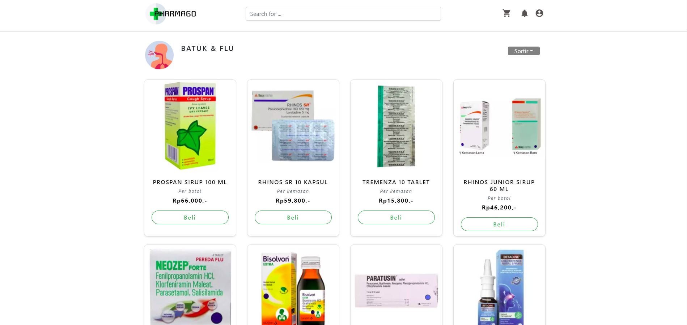
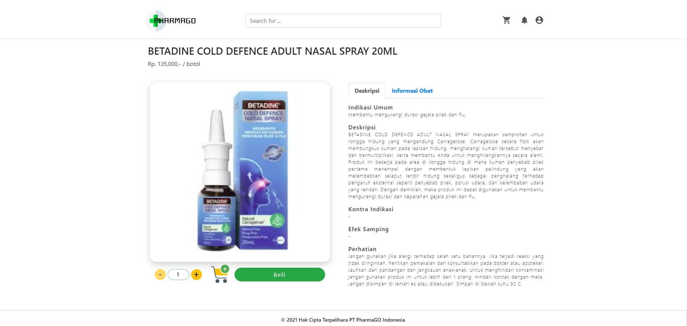
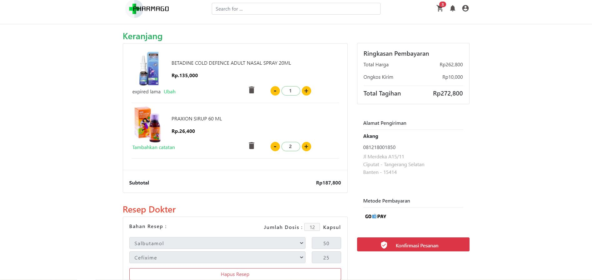

## E-COMMERCE PHARMAGO PROJECT ID

This is my first website that I developed using React JS. An e-commerce website for the healthcare business that I'm also developing. With the hope that this e-commerce will be able to help local businesses, especially in the field of healthcare businesses to achieve better quality.

### Features 

### Library Used (Front End)
- [Reactstrap](https://reactstrap.github.io/) for layouting and make some component.
- [Sweetalert 2](https://sweetalert2.github.io/) for make alert pop-up.
- [Moment](https://momentjs.com/) for generate time format.

### Library Used (Data State Management)
- [Redux and React Redux](https://redux.js.org/) for manage data from local state and global state.
- [Axios](https://www.npmjs.com/package/axios) for get/post/put/delete data from back-end API.

